# 11. Tugas Praktikum
Jelaskan masing-masing maksud kode berikut sesuai nomor kodenya pada laporan praktikum Anda!

1. mylist dan myschema adalah variabel yang digunakan dalam konteks mendefinisikan skema untuk DataFrame di PySpark. mylist biasanya berisi nama kolom, sementara myschema mendefinisikan jenis data dan properti nullable dari setiap kolom.

2. spark.createDataFrame() adalah metode di PySpark yang digunakan untuk membuat DataFrame dari RDD yang ada, daftar atau DataFrame pandas yang sudah ada.

3. parallelize() dan toDF() adalah metode yang digunakan di PySpark untuk mengubah daftar atau kumpulan data menjadi RDD dan DataFrame, masing-masing.

4. hadoop, fs dan put adalah alat baris perintah yang dapat digunakan untuk berinteraksi dengan Hadoop Distributed File System (HDFS). hadoop fs adalah perintah untuk berinteraksi dengan HDFS, sementara put adalah subperintah yang digunakan untuk mengunggah file ke HDFS.

5. pyspark.sql, SQLContext, createOrReplaceTempView() dan show() adalah metode dan kelas di PySpark yang digunakan untuk memanipulasi dan meminta data di Spark SQL. SQLContext adalah kelas yang digunakan untuk membuat konteks Spark SQL, sementara createOrReplaceTempView() adalah metode yang digunakan untuk membuat tampilan sementara dari DataFrame. show() adalah metode yang digunakan untuk menampilkan isi DataFrame.

6. textFile(), map(), lambda(), strip(), StructField() dan StringType() adalah metode dan kelas yang digunakan di PySpark untuk membaca dan memproses file teks. textFile() digunakan untuk membaca file teks, sedangkan map() dan lambda() digunakan untuk mentransformasikan dan menyaring data. strip() digunakan untuk menghapus karakter spasi dari awal dan akhir string. StructField() dan StringType() adalah kelas yang digunakan untuk mendefinisikan skema untuk DataFrame.

7. spark.read.format(), jdbc(), options() dan load() adalah metode di PySpark yang digunakan untuk membaca data dari berbagai sumber. jdbc() digunakan untuk membaca data dari database relasional menggunakan JDBC. options() digunakan untuk menentukan berbagai opsi saat membaca data, seperti jalur ke sumber data. load() digunakan untuk memuat data dari sumber data yang ditentukan.

8. show() adalah metode di PySpark yang digunakan untuk menampilkan isi DataFrame.

9. collect(), rdd() dan take() adalah metode di PySpark yang digunakan untuk mengambil data dari DataFrame. collect() mengambil semua data dari DataFrame dan mengembalikannya sebagai daftar. rdd() mengembalikan RDD yang berisi data di DataFrame. take() mengembalikan baris pertama DataFrame sebanyak n.

10. makeRDD(), Seq() dan createDataset() adalah metode di PySpark yang digunakan untuk membuat RDD dan Dataset dari berbagai sumber.

11. filter() adalah metode di PySpark yang digunakan untuk menyaring data di DataFrame.

12. as(), toDF() dan first() adalah metode di PySpark yang digunakan untuk memanipulasi dan mentransformasikan data di DataFrame. as() digunakan untuk mengubah nama kolom di DataFrame

13. listDatabases: method untuk menampilkan daftar database yang tersedia pada cluster.
    listTables: method untuk menampilkan daftar tabel yang tersedia pada database yang ditentukan.
     listFunctions: method untuk menampilkan daftar fungsi yang tersedia pada database yang ditentukan.
     isCached: method untuk memeriksa apakah suatu DataFrame atau tabel sudah di-cache atau belum.
     select: method untuk memilih kolom atau expression dari DataFrame.

14. Read: method untuk membaca data dari file atau sumber data lainnya menjadi DataFrame.
    text: method untuk membaca data dari file teks menjadi RDD (Resilient Distributed Dataset).
    
15. load: method untuk membaca data dari file ke dalam DataFrame.
    json: format untuk menyimpan data dalam bentuk teks dengan format JSON.
    format: method untuk menentukan format data yang ingin di-load atau di-save.
    printSchema: method untuk menampilkan skema dari suatu DataFrame.

16. write: method untuk menulis DataFrame ke dalam sumber data atau file.
    save: method untuk menyimpan DataFrame ke dalam sumber data atau file.
    
17. parquet: format file untuk menyimpan data dalam bentuk kolomar (columnar) dan dikompresi.

18. Options: parameter untuk mengatur opsi saat membaca atau menulis data.
    inferSchema: parameter untuk mengaktifkan fitur inferensi skema, sehingga skema dapat dibaca langsung dari data.
    csv: format file untuk menyimpan data dalam bentuk CSV (Comma-Separated Values).
     header: parameter untuk mengaktifkan atau menonaktifkan header pada file CSV.
    codec: parameter untuk menentukan codec yang digunakan untuk mengompresi data pada file.

## Analitik dengan DataFrames
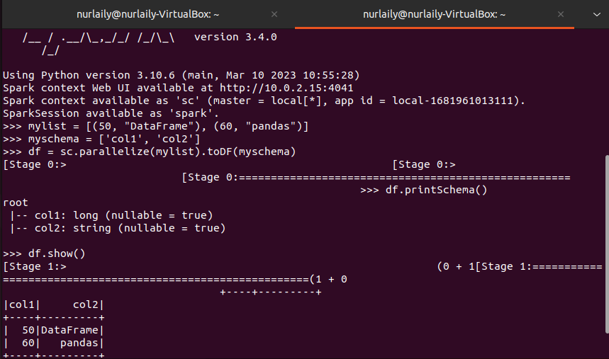
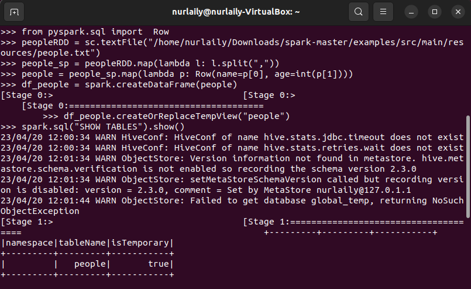
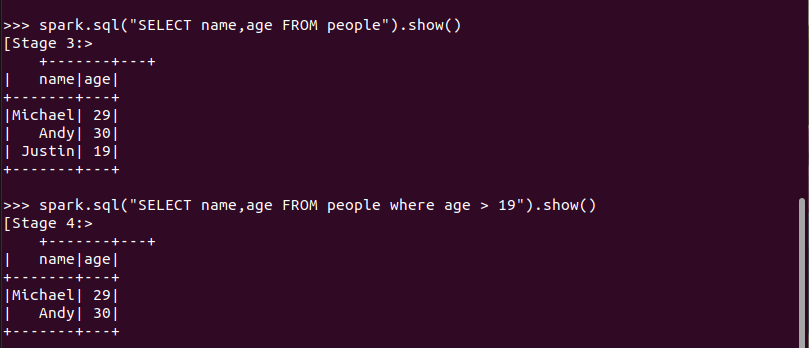

## Membuat DataFrame dari Database Eksternal
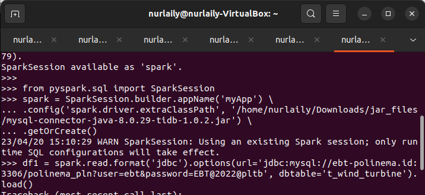

## Mengonversi DataFrames ke RDDs
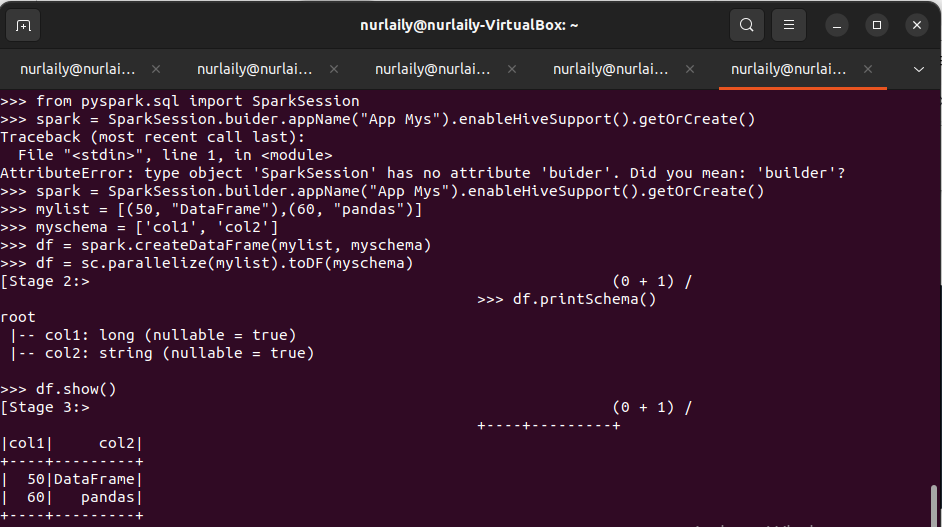
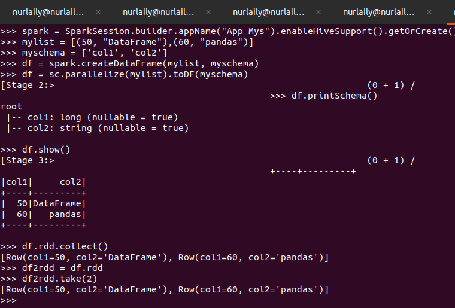

## Membuat Datasets
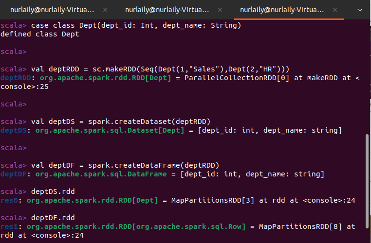
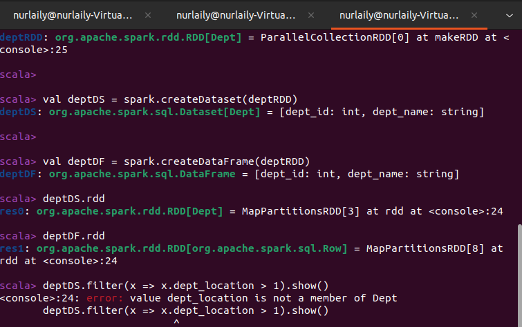

## Mengonversi DataFrame ke Datasets dan sebaliknya
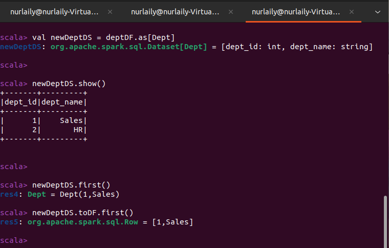

## Mengakses Metadata menggunakan Catalog
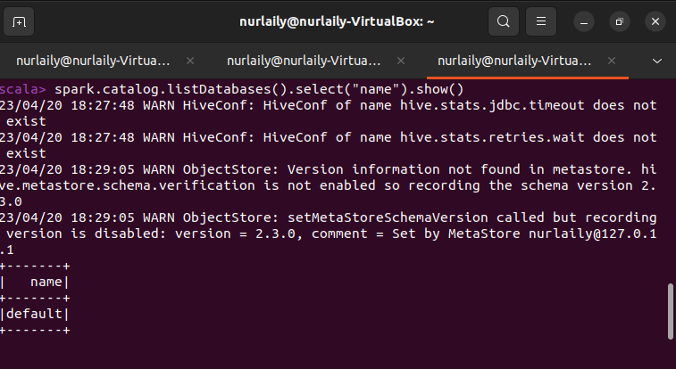
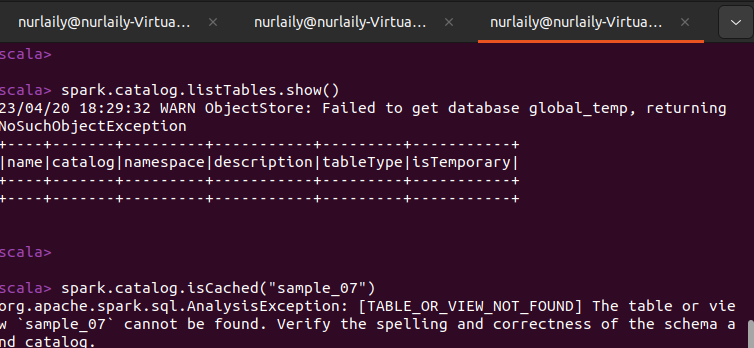
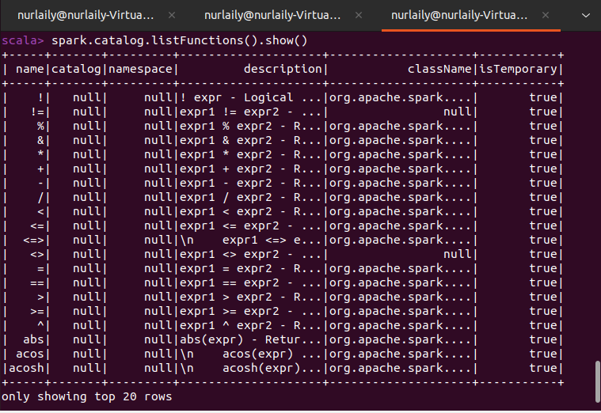

## Bekerja dengan berkas teks
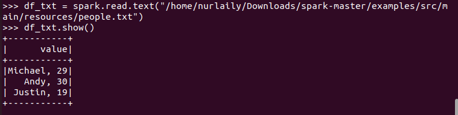

## Bekerja dengan JSON
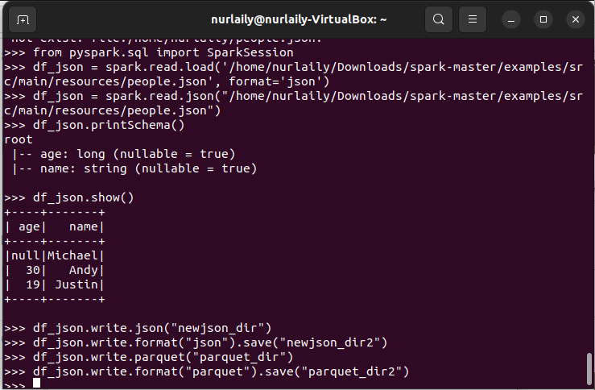

## Bekerja dengan CSV
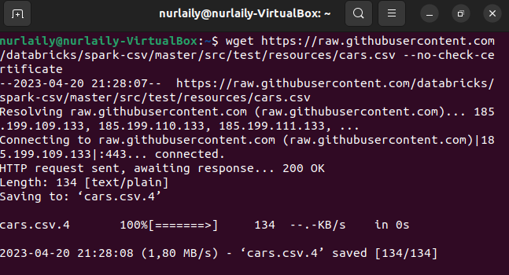
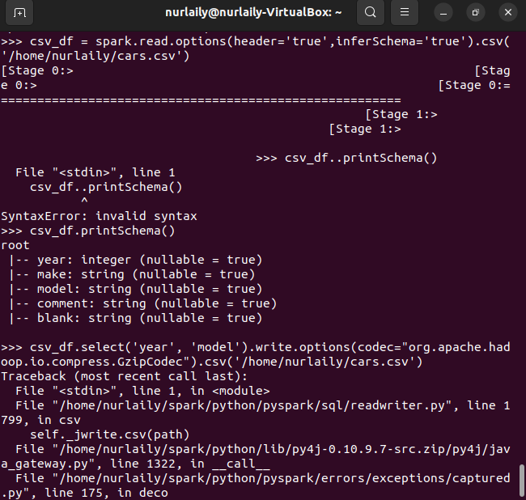
